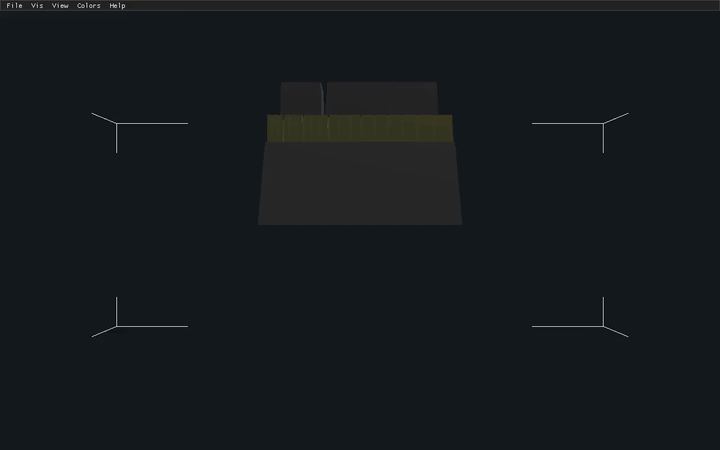

# FSV

> **metal-port branch** — this branch **is** the macOS/Metal port of fsv: a
> native SDL3 GPU (Metal) renderer with a Dear ImGui interface, replacing
> the GTK3 + OpenGL frontend on macOS. The legacy GTK/OpenGL frontend is
> preserved and keeps building on Linux. See [`docs/PORTING.md`](docs/PORTING.md)
> for the full porting record. For the original GTK/OpenGL-only project,
> use [jabl/fsv](https://github.com/jabl/fsv).



*(GIF above is size-optimized — 15fps, downscaled. See
[`docs/media/demo.mp4`](docs/media/demo.mp4) for the smooth, full-resolution
version.)*

This repo is a fork of [fsv](http://fsv.sourceforge.net/), updated to current environments.
The original author is [Daniel Richard G.](https://github.com/iskunk), a former student of Computer Science at the MIT.

## About fsv

> fsv (pronounced eff-ess-vee) is a file system visualizer in cyberspace. It lays out files and directories in three dimensions, geometrically representing the file system hierarchy to allow visual overview and analysis. fsv can visualize a modest home directory, a workstation's hard drive, or any arbitrarily large collection of files, limited only by the host computer's memory and graphics hardware.

Its ancestor, SGI's `fsn` (pronounced "fusion") originated on IRIX and was prominently featured in Jurassic Park: ["It's a Unix system!"](https://www.youtube.com/watch?v=3HjOjvu6oKA).

[Screenshots](http://fsv.sourceforge.net/screenshots/) of the original clone are still available.

Useful info and screenshots of the original SGI IRIX implementation are available on [siliconbunny](http://www.siliconbunny.com/fsn-the-irix-3d-file-system-tool-from-jurassic-park/).

## Install

### macOS (primary)

```sh
brew install glib cglm meson ninja pkgconf sdl3
meson setup builddir
ninja -C builddir
./builddir/src/sdl/fsv [dir]
```

`frontend=sdl` (the SDL3/Metal renderer, this port) is the default on
every platform. `[dir]` defaults to the current directory if omitted.

- **`.app` bundle** (optional, for double-clicking instead of running from
  a terminal): `packaging/macos/make-bundle.sh` copies the binary built
  above into a standard bundle layout and ad-hoc code-signs it —
  `packaging/macos/make-bundle.sh && open fsv.app`. See
  [`packaging/macos/make-bundle.sh`](packaging/macos/make-bundle.sh) for
  details (also used to build the tarball layout below).
- **Xcode project** (optional, for people who'd rather hit Cmd-B than type
  `meson`/`ninja`): `open packaging/xcode/fsv.xcodeproj`. It's a thin
  wrapper around the same Meson build — see
  [`packaging/xcode/README.md`](packaging/xcode/README.md).
- **Prebuilt binaries**: every push builds macOS (arm64) and Linux
  (x86_64) binaries; tagged releases (`v*`) attach both as `.tar.gz`
  assets on the [GitHub Releases](../../releases) page — see
  [`.github/workflows/ci.yml`](.github/workflows/ci.yml). The macOS
  binary still needs Homebrew's libraries at runtime (`brew install glib
  sdl3`): it links them by their `/opt/homebrew/opt/…` install paths and
  they are not bundled, so this applies to an `.app` built from it too.
  Without them it exits immediately with a dyld "Library not loaded"
  error.

### Linux

**GTK frontend** (the legacy, OpenGL-based UI — the one Linux distributions
have packages for today):

```sh
sudo apt install libgtk-3-dev libgl1-mesa-dev libglu1-mesa-dev libepoxy-dev libcglm-dev
meson setup builddir -Dfrontend=gtk
ninja -C builddir
sudo ninja -C builddir install
```

cglm is available as of Ubuntu 20.10; on older systems, vendor it as a
Meson subproject: `mkdir -p subprojects && cd subprojects && tar xaf
/path/to/cglm-version.tar.gz && mv cglm-version cglm`.

**SDL frontend** (this port's renderer, on Linux): needs SDL3 ≥ 3.2, which
has no `apt` package on Ubuntu 22.04/24.04 as of this writing (it lands in
Ubuntu starting with 25.10) — build it from source, or install it from
your distribution if a package is available, then:

```sh
meson setup builddir -Dfrontend=sdl
ninja -C builddir
./builddir/src/sdl/fsv [dir]
```

CI builds this configuration on every push against a from-source SDL3
(see `.github/workflows/ci.yml`'s `linux-sdl` job) as a best-effort arm;
`linux-gtk` is the load-bearing Linux build.

## Controls

Gestures in the 3D viewport (ported from the original `viewport.c` mouse
handling — see [`src/sdl/input.cpp`](src/sdl/input.cpp)):

| Input | Action |
|---|---|
| Hover (no button held) | Highlight the node under the cursor; show its path in the status bar |
| Left-click, release | Select the node under the cursor and fly the camera to it ("look at") |
| Middle-drag | Dolly (zoom) the camera in/out |
| Ctrl + left-drag | Revolve the camera around the current target |
| Scroll wheel | Dolly (zoom) — an addition in this port; upstream fsv has no wheel gesture, only the middle-drag |
| Double-click a directory | Toggle expand/collapse of that directory — an addition in this port; upstream fsv (and this port, before this addition) treats a double-click as just two ordinary left-clicks in a row, with no directory-activation gesture in the 3D view at all |
| Right-click | Open the context menu for the node under the cursor (Look At, Properties…, Expand/Collapse) |
| Escape | Collapse the current directory if it's expanded, otherwise collapse its parent and fly the camera there — an addition in this port; upstream fsv has no keyboard handling in the 3D view at all. Does nothing if a context menu or other ImGui popup is open (that gets to consume Escape first) |

Double-clicking a file, or empty space, has no special action beyond
the ordinary left-click behavior above (select + fly the camera there
twice) — the toggle only applies to directories.

Menu highlights (menu bar at the top of the window):

| Menu | Notable items |
|---|---|
| **File** | Change Root… (pick a new directory to visualize), Rescan, Quit |
| **Vis** | Switch between the three visualization modes — DiscV, MapV, TreeV |
| **View** | Toggle the docked Directory Tree & Files panel |
| **Colors** | Color nodes by type, by timestamp, or by wildcard pattern; Setup… opens the full color editor (settings persist to `~/.fsvrc`) |
| **Help** | Controls (this table, in-app), About fsv… |

## What's been done

### The macOS / Metal port (this branch)

- Extracted a headless, GTK-free core (`libfsvcore`: scanning, geometry
  layout, camera math, color/persistence logic) behind a small
  platform-hooks header, with a `fsv-scan` CLI and unit tests exercising
  it independently of any UI.
- Replaced the OpenGL renderer with SDL3's GPU API (Metal on macOS,
  Vulkan-capable on Linux): shaders ported to GLSL 4.50, compiled offline
  to MSL and SPIR-V, and embedded directly in the binary.
- Rebuilt the entire UI in Dear ImGui — menu bar, docked directory-tree
  and file-list panels, color-setup and node-properties dialogs — with no
  GTK dependency in this frontend.
- Ported real mouse-driven object picking (color-ID offscreen readback)
  so clicking, hovering, and the context menu all resolve the actual node
  under the cursor.
- Implemented `nvstore.c` — the settings-persistence backend — for real.
  It was a complete no-op stub upstream on *both* frontends, silently
  discarding every color-setup change; it now serializes to `~/.fsvrc`,
  fixing persistence for the GTK frontend too.
- Added a scripted `--record` mode and screenshot support for
  headless/offscreen rendering, used to produce the demo video above and
  as a CI smoke test.
- Set up GitHub Actions CI: a macOS/Metal build, a Linux/GTK
  anti-regression build, a best-effort Linux/SDL build, and a release job
  that attaches macOS (arm64) and Linux (x86_64) binaries to tagged
  releases.
- Added an optional Xcode project (an external-build-system wrapper
  around the same Meson build) and a `.app`-bundling script for people
  who don't want to use the command line.
- Kept the GTK/OpenGL frontend building and working throughout — it's a
  separate `meson` target, not a fork of this one, and Linux CI builds it
  on every push.

### Inherited from jabl/fsv

- Migrated the UI from GTK+2 to GTK+3, including dropping every
  deprecated GTK/GDK API along the way.
- Modernized the OpenGL path to core-profile OpenGL 3.1 / GLSL 1.40:
  shaders and VBOs instead of the immediate-mode/display-list code the
  original SGI-era `fsv` used, with linear algebra moved onto `cglm`.
  `GL_QUADS` became `GL_TRIANGLES` throughout.
- Replaced the deprecated `GL_SELECT` picking mechanism with a modern
  color-ID offscreen-render-and-read-back technique — the same technique
  this port's Metal picking is itself based on.

### Known limitations / ideas

- **GTK4**: the GTK arm is still GTK+3; a GTK4 migration was scoped
  upstream but never completed (see the GTK/OpenGL frontend notes below).
- **DiscV**: has a few rougher visual edges than MapV/TreeV on both
  frontends — not a regression from this port, just an area that never
  got as much polish upstream.
- **Line width**: SDL_GPU has no equivalent of `glLineWidth()` on any
  backend, so every line (including the node cursor's outline) renders 1
  pixel wide on the SDL/Metal frontend — a small, deliberate cosmetic
  difference from the thicker lines the GTK/OpenGL build draws.
- **GTK frontend testing**: the GTK arm only builds a real GUI on Linux
  (macOS lacks a usable `GL/glu.h`), so its interactive behavior needs a
  Linux machine or container to exercise visually.

<details>
<summary>GTK/OpenGL frontend notes (OpenGL versions and compatibility)</summary>

Gtk+3 tries to create a OpenGL 3.2 core context (since 3.16), and if that fails
it falls back to whatever legacy context it manages to create (since 3.20).
Thus one cannot assume availability of any legacy pre-3.2 API's that are
dropped in a core context. So for maximum compatibility use the oldest API's
still possible in 3.2.

For the shading language version, the latest [OpenGL core
specification](https://www.khronos.org/registry/OpenGL/specs/gl/glspec46.core.pdf)
says "The core profile of OpenGL 4.6 is also guaranteed to support all previous
versions of the OpenGL Shading Language back to version 1.40". Thus GLSL 1.40
is the minimum version. This corresponds to OpenGL 3.1. However, it also says
that "OpenGL 4.6 implementations are guaranteed to support versions 1.00, 3.00,
and 3.10 of the OpenGL ES Shading Language.". So that is also an alternative.
There's also WebGL 2.0 that roughly corresponds to OpenGL ES 3.0 & OpenGL 3.3
and also uses GLSL ES 3.0.

Fsv is a relatively simple OpenGL application and doesn't need very fancy
features. Thus, aim for OpenGL 3.1 and GLSL 1.40 in order to provide maximum
compatibility.

</details>
